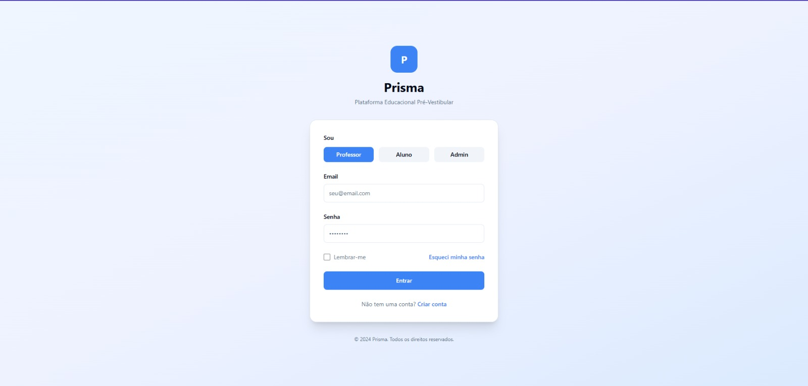
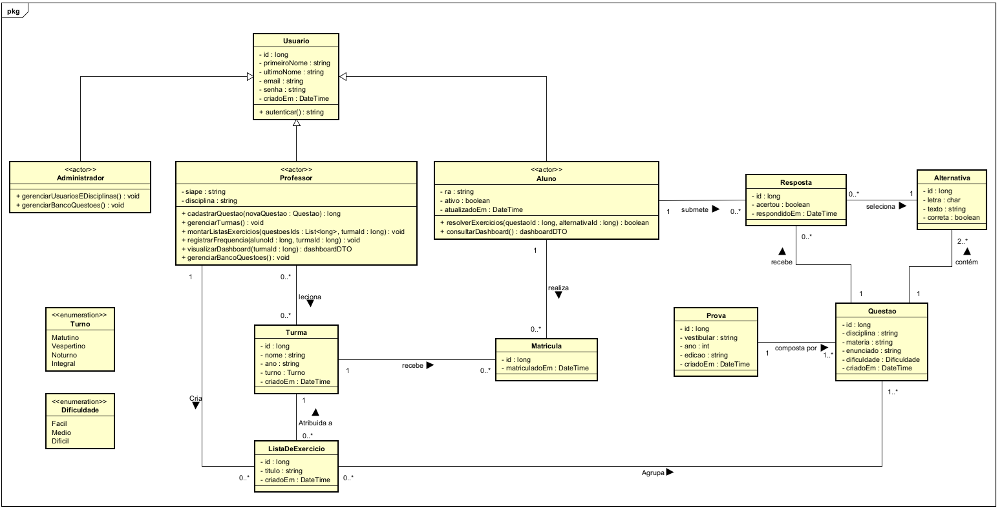

# Prisma
---

## Sumário
1. [Introdução](#1-introdução)
2. [Descrição Geral do Sistema](#2-descrição-geral-do-sistema)
3. [Desenvolvimento do Projeto](#3-desenvolvimento-do-projeto)
4. [Requisitos do Sistema](#4-requisitos-do-sistema)
5. [Análise do Sistema](#5-análise-do-sistema)
6. [Implementação](#6-implementação)
7. [Considerações Finais](#7-considerações-finais)
8. [Bibliografia](#8-bibliografia)

---

## 1. Introdução

### Contexto
O projeto será implementado no Cursinho Prisma, um projeto de extensão da Universidade Tecnológica Federal do Paraná (UTFPR - Câmpus Cornélio Procópio) focado na preparação gratuita de estudantes para o vestibular e o ENEM. A instituição opera em um cenário de alta demanda social e capacidade estrutural limitada, ofertando apenas uma turma por semestre de 40 a 45 alunos, com cerca de 80 a 90 alunos aplicando para o projeto.

Devido a essa limitação, o processo de admissão é rigoroso. Historicamente o critério era a de maior média escolar, a triagem evoluiu, a partir da edição de 2026/02, para a aplicação de uma prova classificatória de múltipla escolha. A alocação das vagas obedece a um sistema de prioridades: a preferência é destinada aos alunos matriculados no 3º ano do Ensino Médio, seguidos por alunos de outras séries do ensino médio e, por fim, estudantes egressos.

Uma vez inserido no projeto, o aluno ingressa em um ecossistema com regras administrativas e pedagógicas rígidas. Administrativamente, exige-se uma frequência mínima obrigatória de 75%, o descumprimento desta meta resulta na expulsão sumária do estudante. Pedagogicamente, a instituição não dispõe de infraestrutura e/ou recursos humanos para oferecer atividades de reforço ou turmas extras de nivelamento. O aluno depende exclusivamente da carga horária regular e de sua própria capacidade de autodidatismo para superar defasagens nas disciplinas. Atualmente, os processos de controle (frequência) e apoio (materiais) operam de forma puramente manual e descentralizada.

### Justificativa

O desenvolvimento deste software justifica-se pela necessidade de mitigar dois riscos críticos da operação atual do Cursinho Prisma: a "cegueira de dados" pedagógica e a vulnerabilidade do controle administrativo manual.

No aspecto pedagógico, o problema central é a ineficiência no processo de curadoria de exercícios e a total ausência de telemetria sobre o aprendizado. As questões são extraídas manualmente pelos professores a partir de provas anteriores de diversos vestibulares e do ENEM. Esse processo de triagem, categorização e formatação gera uma sobrecarga que inviabiliza a criação constante de listas personalizadas. Sem aulas de reforço para diagnosticar defasagens, os alunos e a coordenação operam no escuro. Um estudante pode ter um déficit em uma matéria específica (ex: Logaritmos), mas essa lacuna passará despercebida até o dia da prova final, resultando em nivelamento acadêmico deficiente e provável evasão.

No aspecto administrativo, o controle da regra de 75% de frequência feito manualmente aumenta o risco de falhas operacionais, registros incorretos e expulsões indevidas (ou a não detecção de evasão iminente).

Ao automatizar o fluxo de avaliações e instituir uma cultura de dados, o sistema converte a simples ação de "responder questões" em um motor de telemetria educacional. Isso elimina o atrito operacional do professor na criação de listas direcionadas e fornece ao aluno métricas de suas dificuldades, compensando tecnologicamente a ausência de tutoria individualizada.

### Proposta

A aplicação é uma plataforma web pensada para reduzir o trabalho operacional na criação de avaliações e melhorar o acompanhamento do desempenho acadêmico. A ideia principal é conectar a rotina dos professores com a prática dos alunos, usando automação para diminuir tarefas manuais, principalmente na organização e categorização de questões.

No módulo do docente, o foco está na gestão e no uso de dados para facilitar o dia a dia. O sistema oferece uma interface para cadastro de questões com suporte a texto e imagens. Um dos recursos é a integração com inteligência artificial, que analisa o conteúdo das questões e sugere automaticamente a classificação por disciplina e nível de dificuldade, ajudando a manter o banco de dados mais organizado. Também há ferramentas para gerenciar turmas (como criar e gerenciar uma turma de alunos com dificuldade em matemática) e montar listas de exercícios de forma rápida, com base em filtros. Além disso, os painéis analíticos permitem acompanhar o desempenho das turmas e dos alunos, ajudando a identificar onde estão as principais dificuldades.

Já o módulo do aluno é voltado para a prática e o acompanhamento do próprio desempenho. O aluno pode acessar tanto o banco geral de questões quanto listas específicas enviadas pelos professores. A proposta é incentivar a resolução contínua e dar mais clareza sobre o progresso. O sistema também conta com um painel individual que mostra a frequência e o histórico de acertos e erros, permitindo que o aluno identifique seus pontos fortes e onde precisa melhorar, considerando disciplinas e níveis de dificuldade.

### Organização do Documento

O capitulo 1 apresenta o contexto do Cursinho Prisma, a justificativa do problema a ser resolvido e a proposta de solução beaseada em IA e gestão de dados. O capitulo 2 detalha os objetivos gerais especificos do sistema, expõe as limitações técnicas impostas pelo processamento da IA, e define os papéis dos usuários envolvidos na operação do sistema. O capitulo 3 detalha as tecnologicas, a metodologia ágil paralela e o cronograma. O capitulo 4 especifica os requisitos funcionais e não-funcionais que guiarão o desenvolvimento. O capitulo 5 apresenta a modelagem do banco de dados e os diagramas de classe e de atividade e por último o capítulo 6 detalha sobre a implementação do projeto a partir de diagramas, instruções para implantação e configuração local, e as telas principais já finalizadas

---

## 2. Descrição Geral do Sistema

### Objetivos

* **Geral:** Desenvolver e implantar um sistema web para gestão educacional focado em avaliação de desempenho e criação de listas de exercícios, sustentado por um banco de questões alimentado colaborativamente através de uma interface assistida por IA para automação da categorização e da dificuldade
* **Específicos:** Metas e ações que, somadas, permitem alcançar o objetivo geral.
  * Desenvolver uma interface web otimizada para inserção rápida de questões (textos e imagens manuais)
  * Integrar um modelo de IA local (como o Ollama) à API para processar textos de questões inseridas e retornar sugestões estruturadas de categorização e dificuldade. A categorização será dividida conceitualmente em Macrodisciplina (grandes áreas do conhecimento, ex: Matemática, Física) e Microdisciplina (tópicos específicos daquela área, ex: Funções de 1º Grau, Cinemática);
  * Desenvolver o módulo do professor, permitindo o agrupamento de questões em listas e a gestão de turmas
  * Desenvolver o módulo do aluno para resolução de exercicios
  * Implementar dashboards de proficiência baseados no histórico de resoluções

### Limites e Restrições

* **Limites:** O que a aplicação **não** fará (mesmo que pareça óbvio).
  * Limitação de extração: O sistema não realizará, em sua versão inicial, a extração autônoma, leitura de PDFs e recortes automáticos ou OCR de provas. Toda questão deve ser inserida na interface pelo usuário, seja por digitação ou copiando e colando, com upload manual de imagens pelo usuário
  * Limitação da IA: A IA atuará estritamente como um assistente de preenchimento. O usuário terá a palavra final para aceitar, alterar ou recusar a categoria e a dificuldade proposta pelo modelo antes de salvar no banco
  * Foco do Material Gerenciado: O escopo do sistema foca exclusivamente em avaliação e diagnóstico. O material oferecido pela plataforma resume-se a bancos de questões, listas de exercícios interativas e o controle de desempenho e frequência. O sistema não atua como um repositório de conteúdo passivo, ou seja, não haverá hospedagem de apostilas em PDF, slides ou videoaulas.
  * Interação Sincrona: Esta fora do escopo a criação de fóruns, chats em tempo real, ou transmissão de aulas
  * Integração Externa: O sistema não fará integração com sistemas acadêmicos governamentais ou plataformas externas de vestibulares
  
* **Restrições:**
  * Pela falta de recursos a extração automática de questões diretamente de PDFs de provas não será feita atualmente, podendo ser uma funcionalidade futura
  * A acurácia de categorização não será de 100%, sendo necessário a intervenção manual humana antes da persistência no banco de dados
  * A API que concecta o sistema ao Ollama exige que o servidor de hospedagem tenha capacidade mínima de processamento para inferência do modelo, ou que a API de IA seja isolada em um serviço em nuvem específico
  * Pela falta de recursos, o sistema irá se restringir a usar ferramentas gratuitas ou com tiers gratuitos

### Descrição dos Usuários

* Aluno: Acessa a plataforma web para resolver as listas designadas pelos professores, treina no banco livre (um repositório geral contendo todas as questões já cadastradas que não estão necessariamente associadas a uma lista, permitindo a resolução de maneira individual e autônoma) e acompanha o suas métricas em nível macrodisciplina e microdisciplina 
* Professor/Monitor: Acessa a plataforma web para analisar o desempenho das turmas por meio do dashboard, identifica discrepâncias no desempenho, cadastra novas questões no banco, gera listas de exercícios personalizadas e direcionadas consultando o banco de questões
* Administrador (Coordenação): Gerencia os cadastros de professores e alunos, define a árvore de macro e micro disciplinas no banco e administra o sistema

---

## 3. Desenvolvimento do Projeto

### Tecnologias e Ferramentas

* Serviço de Inteligência Artificial:
  * Linguagem: Python com FastAPI, atuando como uma API interna
  * Categorização Semântica e de dificuldade: Ollama
  * Hospedagem: Ngrok
* Aplicação web E API:
  * Linguagem backend: ASP .NET
  * Linguagem frontend: Angular
  * Hospedagem front: Vercel
  * Hospedagem back-end: Render
  * Conteinerização: Docker 
* Banco de dados e armazenamento:
  * SGBD relacional: PostgreSQL
  * Armazenamento de arquivos: Supabase
  * Hospedagem: Supabase
* Gerenciamento, qualidade e documentação:
  * Versionamento: Git com repositório no GitHub
  * Gerenciamento, gestão e acompanhamento do cronograma: Jira
  * Testes de API: Insomnia
  * Documentação de API: Swagger
  * Comunicação: Whatsapp e reuniões presenciais

### Metodologia

O projeto adota a metodologia de Desenvolvimento Iterativo e Incremental, gerenciado através de um fluxo contínuo baseado em Kanban. Após reavaliação do contexto da equipe, optou-se por descartar frameworks ágeis. A exigência de rituais síncronos fixos (como reuniões diárias ou cerimônias de revisão com datas marcadas) mostrou-se totalmente incompatível com a realidade da equipe, que é composta por integrantes que trabalham em período integral (manhã e tarde) e frequentam as aulas da graduação no período noturno.

Para contornar essa limitação de disponibilidade, a equipe opera em um regime de desenvolvimento assíncrono. O escopo do projeto foi desmembrado no Jira, mas o fluxo de integração não ocorre em dias engessados da semana; em vez disso, funciona sob demanda. A comunicação diária e a resolução de impedimentos são realizadas de forma assíncrona via grupo de mensagens instantâneas (WhatsApp).

À medida que os desenvolvedores possuem tempo hábil (madrugadas e finais de semana) para concluir suas respectivas tarefas, o código é submetido ao repositório central no GitHub. A integração das partes é testada continuamente conforme os pacotes funcionais ficam prontos, garantindo que o sistema evolua de forma orgânica e atenda aos prazos inegociáveis dos marcos (Fases) estabelecidos pelo cronograma da disciplina.

### Cronograma previsto

| Período | Atividades |
|----------|------------|
| 23/03 a 05/04 | **Fundação e Planejamento:** Levantamento de requisitos completo. Protótipos de telas definidos. Modelagem do banco de dados. Definição dos requisitos da IA. Setup inicial de repositórios. |
| 06/04 a 19/04 | **Arquitetura e Base Técnica (Entrega 1 - 07/04):** Configuração de infraestrutura (Docker, repositórios, ambiente local). Estrutura inicial do front-end (layout, login). Setup da IA local (FastAPI). Base do backend iniciada. |
| 20/04 a 03/05 | **Base do Sistema:** CRUD inicial e primeiros microsserviços (Aluno). Integração inicial de front e back. Configuração de banco (Supabase). Estrutura Angular com telas iniciais. Setup da IA preparado. |
| 04/05 a 10/05 | **Módulo Professor:** Microsserviços de Professor e Turmas. CRUD completo de turmas e usuários. Ajustes no retorno da IA. Evolução das telas de gestão. Preparação da entrega 2. |
| 11/05 a 17/05 | **Integração com IA (Entrega 2 - 12/05):** Microsserviço de Questões. Integração com FastAPI da IA. Implementação de autenticação JWT. Tratamento de erros da IA. Tela de cadastro de questões com feedback. Fluxo completo de cadastro de questões com IA funcionando. Sistema do professor integrado e validado. |
| 18/05 a 24/05 | **Listas e Resolução:** Criação de listas de exercícios com filtros. Tela de resolução de exercícios. Testes iniciais com IA em cenários reais. Tela de frequência. |
| 25/05 a 07/06 | **Dashboards e Métricas:** Dashboard do aluno e professor. Métricas de desempenho (acertos, frequência). Estrutura de testes (unitário, integração, E2E). |
| 08/06 a 21/06 | **Otimização e Testes:** Testes de carga e performance. Refinamento da IA (tempo de resposta e precisão). Otimização de queries e backend. Ajustes finais de UX/UI. |
| 22/06 a 28/06 | **Produção Final (Entrega 3 - 23/06):** Deploy completo do sistema. Documentação final. |
---

## 4. Requisitos do Sistema

### Requisitos Funcionais (RF)

| ID | Funcionalidade | Prioridade |
| :--- | :--- | :--- |
| RF01 | O sistema deve prover uma interface para inserção manual do enunciado, alternativas e gabarito, além de upload de imagem de apoio | Essencial |
| RF02 | Ao preencher o enunciado, o sistema deve acionar a IA para sugerir a disciplina, matéria e dificuldade (Fácil/Médio/Difícil) | Essencial |
| RF03 | O professor deve poder aceitar, editar ou recusar as sugestões da IA antes de salvar a questão | Essencial |
| RF04 | Professores e administradores devem poder listar, editar e desativar questões já salvas no banco | Essencial |
| RF05 | O sistema deve gerenciar autenticação e autorização para três perfis: Administrador, Professor e Aluno | Essencial |
| RF06 | Professores devem poder criar turmar e adicionar alunos a elas. O sistema deve permitir que um mesmo aluno seja adicionado a múltiplas turmas simultaneamente (ex: turma regular, turma de reforço de matemática) | Importante |
| RF07 | Professores devem poder buscar questões no banco através de filtros e agrupa-lás em listas atribuídas a turmas específicas | Importante |
| RF08 | Alunos devem poder abrir listas ou o banco de livre, selecionar a alternativa e receber a correção automática no sistema | Essencial |
| RF09 | O sistema deve exibir gráficos para o aluno detalhando sua porcentagem de acertos/erros agrupados por macro e micro disciplinas | Essencial |
| RF10 | O sistema deve exibir relatórios de proficiência mostrando as maiores lacunas de aprendizado da turma e alunos individuais  | Essencial |
| RF11 | A coordenação deve poder gerenciar contas de usuários e a estrutura de disciplinas do banco | Essencial |
| RF12 | O sistema deve fornecer uma interface rápida para o professor registrar a presença ou falta dos alunos | Desejável |
| RF13 | No dashboard do aluno deve haver um indicador exibindo seu percentual de presença  | Desejável |

Descrição dos requisitos:
* **RF01 - Interface de Cadastro Manual e Upload:** O sistema deve fornecer um formulário interativo no front-end para que professores ou monitores insiram o texto bruto da questão, as opções de múltipla escolha e a indicação do gabarito correto. Além disso, deve haver um componente de upload que permita anexar uma imagem à questão, enviando o arquivo diretamente Supabase e salvando a URL no banco de dados.
* **RF02 - Classificação Assistida por IA:**No momento em que o usuário preenche o enunciado da questão no formulário, o front-end deve disparar uma requisição assíncrona. A API ASP .NET repassará o texto para a API Python, que utilizará o modelo Ollama para analisar o contexto. O sistema deve retornar um JSON com a sugestão da disciplina macro, matéria micro e nível de dificuldade, baseando-se estritamente nas categorias existentes no banco de dados.
* **RF03 - Revisão Humana:** A interface não deve salvar a questão automaticamente após o retorno da IA. As sugestões geradas pelo RF02 devem preencher os campos de seleção (dropdown) da tela, servindo apenas como um facilitador. O usuário terá a obrigatoriedade de revisar, alterar ou confirmar essas categorias manualmente antes de submeter o formulário para persistência no banco de dados.
* **RF04 - Gestão de Questões (CRUD Base):** O sistema deve permitir operações completas de manipulação do acervo. Usuários com perfil de Professor ou Administrador poderão visualizar todas as questões em formato de lista (com filtros), editar o conteúdo de questões e desativar/excluir questões desatualizadas do banco.
* **RF05 - Autenticação e Autorização:** O sistema deve possuir uma tela de login centralizada. Utilizando tokens JWT, o back-end validará as credenciais e as permissões. A interface web deve se adaptar ao perfil logado: alunos não podem ver telas de cadastro de questões, professores não podem acessar o painel de criação de usuários da administração.
* **RF06 - Gestão de Turmas:** O perfil professor deve ter acesso a um painel para criação e gerenciamento de "Turmas" (grupos lógicos de alunos). O professor poderá buscar alunos cadastrados no sistema e vinculá-los a uma ou mais turmas, permitindo que um mesmo aluno participe simultaneamente de diferentes turmas (por exempo, turma regular e turmas de reforço), facilitando a organização e distribuição de atividades.
* **RF07 - Criação de Listas de Exercícios:** O professor deve acessar uma interface de busca no banco de questões consolidado. Através de filtros (por disciplina, matéria e dificuldade), ele poderá selecionar múltiplas questões e agrupá-las em uma "Lista". Esta lista será então atribuída a uma ou mais Turmas cadastradas (RF06).
* **RF08 - Resolução de Exercícios (Aluno):** O aluno logado deve acessar um painel com suas Listas Pendentes. Ao abrir uma lista ou buscar questões soltas no Banco Livre, ele verá a questão formatada, selecionará uma alternativa e enviará a resposta. O sistema deve registrar a tentativa no banco de dados e retornar o gabarito, indicando acerto ou erro.
* **RF09 - Dashboard de Autodesempenho (Aluno):** O sistema deve processar o histórico de resoluções do aluno logado e renderizar gráficos visuais. O painel deve destacar a taxa global de proficiência e quebrar os dados especificamente pelas macro e micro disciplinas (ex: 90% de acerto em Matemática, mas apenas 20% em Trigonometria), orientando o estudo individual.
* **RF10 - Dashboard de Desempenho e Defasagem (Professor):** O sistema deve consolidar as métricas de todos os alunos de uma turma e gerar relatórios visuais para o professor. O objetivo deste painel é identificar tendências de erro coletivas (ex: "70% da Turma A errou as questões de estequiometria na última lista"), permitindo intervenções pedagógicas direcionadas, além de permitir o detalhamento para visualizar alunos com risco de evasão.
* **RF11 - Gestão Administrativa de Perfis e Estrutura:** A coordenação do cursinho (administrador) terá um painel exclusivo para realizar o CRUD de usuários (cadastrar ou remover acessos de professores e alunos) e gerenciar a "Árvore de Disciplinas" (inserir novas matérias no banco que guiarão tanto o filtro dos professores quanto as restrições da Inteligência Artificial).
* **RF12 - Gerenciamento de Frequência (Chamada):** O sistema deve fornecer uma interface rápida para o perfil Professor selecionar uma Turma, uma data específica e registrar a presença ou falta dos alunos vinculados aquela turma, persistindo o histórico de frequência no banco de dados.
* **RF13 - Consulta de Frequência (Aluno):** No painel do aluno, deve haver um indicador visual simples exibindo seu percentual de presença acumulado nas aulas, calculado a partir dos registros inseridos pelos professores.

### Requisitos Não-Funcionais (RNF)

| ID | Requisito | Categoria |
| :--- | :--- | :--- |
| RNF01 | O tempo de espera pela sugestão da IA não deve travar a tela, exibindo indicação visual de carregamento | Usabilidade |
| RNF02 | O front-end deve ser responsivo e seguir princípios que garantem o uso no mobile, sem perda de funcionalidades para telas de smartphones | Usabilidade |
| RNF03 | O banco de dados deve impor restrições de chave estrangeira rígidas entre as micro e macro disciplinas para impedir a categorização para categorias inexistentes | Confiabilidade |
| RNF04 | O sistema não deve expor a comunicação direta com a IA, o front-end deve apenas fazer requisições à API, que atuará como intermediária segura para o Ollama | Segurança |
| RNF05 | Senhas devem ser protegidas no banco utilizando algum algoritmo de hashing | Segurança |
| RNF06 | O tempo de resposta das consultas da API para a renderização do dashboard não deve ultrapassar 3 segundos | Desempenho |

### Diagrama de Casos de Uso

*Diagrama representando as interações dos alunos, professores e administradores com o sistema cursinho prisma.*

### Protótipos de Telas

#### Tela de Login
- **Objetivo:** Autenticar os usuários e direcioná-los para o ambiente correto de acordo com o seu perfil.
- **Dinâmica de Navegação:** É a tela inicial do sistema. A partir dela, dependendo da aba selecionada e da validação das credenciais, o usuário é redirecionado para o seu respectivo dashboard. Também possui link para a recuperação de senha.
- **Requisitos Funcionais Atendidos:** **RF05 - Autenticação e Autorização**.

*Tela de login*

#### Dashboard do Professor
- **Objetivo:** Fornecer um painel gerencial resumido para o educador. Apresenta métricas-chave como total de alunos, questões cadastradas, desempenho médio das turmas e tendências de notas, além de alertas.
- **Dinâmica de Navegação:** É a tela principal acessada após o login do perfil professor. Através do menu lateral, permite navegar para "Cadastrar Questão", "Banco de Questões" e "Criar Lista". Possui também um botão de atalho rápido "+ Nova Questão" que leva à tela de cadastro.
- **Requisitos Funcionais Atendidos:** **RF10 - Dashboard de Desempenho e Defasagem (Professor)**.

*Dashboard do professor*

#### Tela de Cadastro de Questões
- **Objetivo:** Permitir a inserção de novas questões no banco de dados da plataforma. Oferece campos para o enunciado, alternativas, upload de imagem e uma área dedicada à assistência de inteligência artificial para classificação.
- **Dinâmica de Navegação:** Pode ser acessada pelo menu lateral ou pelo botão de ação rápida no dashboard do professor. Após preencher os dados e clicar no botão de submissão, a tela deve salvar a questão e redirecionar o usuário para o "Banco de Questões" ou limpar o formulário para um novo cadastro.
- **Requisitos Funcionais Atendidos:** **RF01 - Interface de Cadastro Manual e Upload**; **RF02 - Classificação Assistida por IA**; **RF03 - Revisão Humana**.

*Tela de cadastro de questões*

#### Tela de Criar Listas
- **Objetivo:** Interface para agrupar questões previamente cadastradas e transformá-las em avaliações ou exercícios direcionados a grupos específicos de alunos.
- **Dinâmica de Navegação:** Acessada pelo menu lateral. O professor preenche o nome da lista, seleciona a turma e visualiza as questões adicionadas. Pode abrir uma sub-tela chamando o "Banco de Questões" para adicionar mais itens. Ao clicar em "Gerar Lista", retorna ao dashboard ou à área de gestão de turmas.
- **Requisitos Funcionais Atendidos:** **RF06 - Gestão de Turmas**; **RF07 - Criação de Listas de Exercícios**.

*Tela de criar listas*

#### Tela do Banco de Questões
- **Objetivo:** Funcionar como um repositório pesquisável e filtrável de todo o acervo da instituição. Permite encontrar questões específicas por disciplina, macro/micro área e dificuldade.
- **Dinâmica de Navegação:** Acessada pelo menu lateral do perfil professor. Serve como tela de consulta e também atua em conjunto com a tela de "Criar Lista". Clicar em uma questão específica pode abrir uma tela de edição (CRUD) ou exibir seus detalhes.
- **Requisitos Funcionais Atendidos:** **RF04 - Gestão de Questões**.

*Tela do banco de questões*

### Tela de Gerenciamento de Frequência
- **Objetivo:** Fornecer uma interface para que o professor realize a chamada (registro de presenças e faltas) dos alunos de uma turma em uma data específica. Apresenta indicadores de status (presentes, ausentes e não marcados) e opções rápidas de preenchimento, como "Marcar Todos Presentes".
- **Dinâmica de Navegação:** Acessada através do menu lateral "Frequência" no ambiente do professor. O professor seleciona a turma e a data nos filtros superiores, marca o status individual de cada aluno na lista abaixo e pode alternar para a aba "Histórico" para consultar chamadas anteriores.
- **Requisitos Funcionais Atendidos:** **RF12 - Gerenciamento de Frequência**.

*Tela de gerenciamento de frequência*

#### Dashboard do Aluno
- **Objetivo:** Apresentar a área de estudos e autoconhecimento do aluno. Exibe a média geral, exercícios resolvidos, tempo de estudo, melhor disciplina e gráficos de evolução. Abaixo, lista as atividades pendentes a serem feitas.
- **Dinâmica de Navegação:** Tela inicial do aluno após o login. A partir das "Listas de Exercícios Disponíveis" na parte inferior, o aluno clica em "Continuar", o que o redireciona diretamente para a tela de "Resolução de Exercício".
- **Requisitos Funcionais Atendidos:** **RF09 - Dashboard de Autodesempenho**; **RF13 - Consulta de Frequência**.

*Dashboard do aluno*

#### Tela de Resolução do Exercício
- **Objetivo:** É o ambiente de estudo. Foca inteiramente na leitura do enunciado da questão e seleção da alternativa correta pelo aluno, com indicativos de progresso.
- **Dinâmica de Navegação:** Chamada a partir do dashboard do aluno. O usuário navega internamente usando os botões "Anterior" e "Próxima". Ao finalizar a última questão, submete as respostas e é redirecionado ao dashboard ou à tela de gabarito.
- **Requisitos Funcionais Atendidos:** **RF08 - Resolução de Exercícios**.

*Tela de resolução do exercício*

### Painel Administrativo
- **Objetivo:** Permitir que a coordenação gerencie os acessos ao sistema e a estrutura curricular da plataforma. A tela oferece controles para adicionar, visualizar, ativar, inativar ou excluir perfis de usuários, além de possuir uma aba dedicada à gestão das disciplinas.
- **Dinâmica de Navegação:** É a tela inicial acessada após o login com o perfil de administrador. O usuário interage internamente alternando entre as abas "Usuários" e "Disciplinas" para realizar as operações de cadastro e manutenção correspondentes.
- **Requisitos Funcionais Atendidos:** **RF11 - Gestão Administrativa de Perfis e Estrutura**.

*Painel Administrativo*

---

## 5. Análise do Sistema

### Modelo do Banco de Dados
* **Conceitual/Lógico:** [Link ou Imagem do MER]
* **Dicionário de Dados:** Detalhamento de tabelas, atributos, tipos e chaves.

### Diagramas Técnicos
* **Diagrama de Classes:** Estrutura das classes e seus relacionamentos.

* **Diagrama de Atividades:** Fluxo de tarefas e processos do sistema.
* RF01/RF02/RF03: 

* RF04: 

* RF05: 

* RF06: 

* RF07: 

* RF08: 

* RF09/RF13: 

* RF10: 

* RF11: 

* RF12: 

---

## 6. Implementação

### Estrutura do Código
Explicação da organização de arquivos e pacotes.
src/
 ├── controllers/    # Lógica de controle
 ├── models/         # Entidades e Banco de Dados
 ├── views/          # Interface do usuário
 └── services/       # Regras de negócio

Siga os passos abaixo para executar o projeto localmente:
1. **Requisitos:** Certifique-se de ter instalado o [Ex: Node.js / Docker / Python].
2. **Configuração:** - Clone o repositório: `git clone [URL_DO_REPO]`
   - Configure as variáveis de ambiente no arquivo `.env`.
3. **Comandos de Inicialização:**

   # Instalar dependências
   npm install 
   
   # Rodar migrações do banco
   npm run migrate 
   
   # Iniciar aplicação
   npm start

### Telas Principais
Apresente aqui os prints do sistema finalizado (não mais o protótipo).
* **Tela X:** Descrição do objetivo e como navegar por ela.
* **Tela Y:** Descrição do objetivo e como navegar por ela.

---

## 7. Considerações Finais
Nesta seção, discuta os resultados obtidos:
* **Sucessos:** O que foi atingido conforme o planejado?
* **Limitações:** O que não foi possível implementar e por quê?
* **Futuro:** Possíveis integrações e melhorias para versões posteriores.

---

## 8. Bibliografia
* Autor, Título da Obra, Edição, Local, Editora, Ano.
* Documentação técnica de [Tecnologia X].
* Links e referências externas consultadas.
